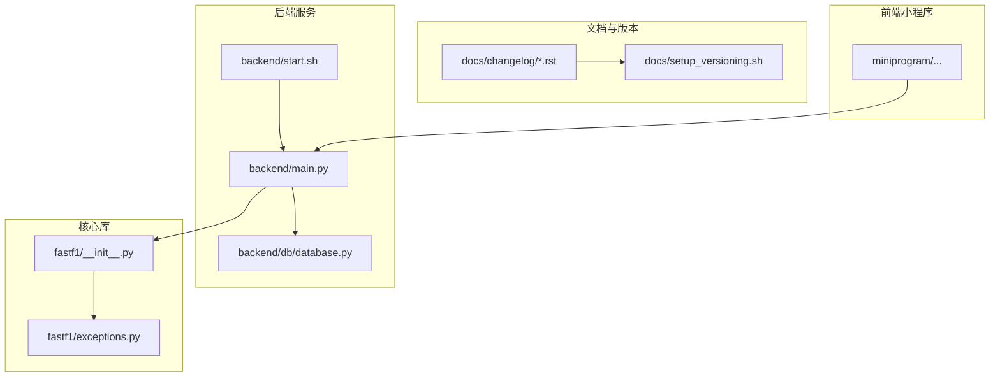
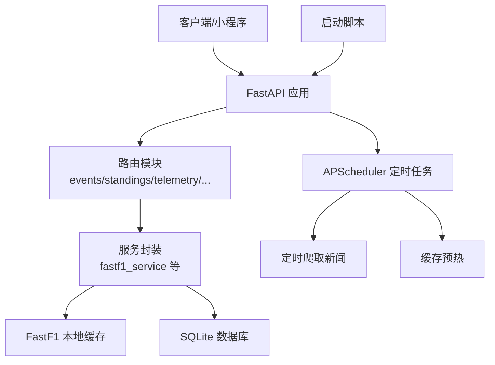
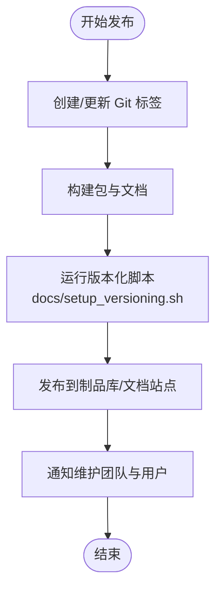
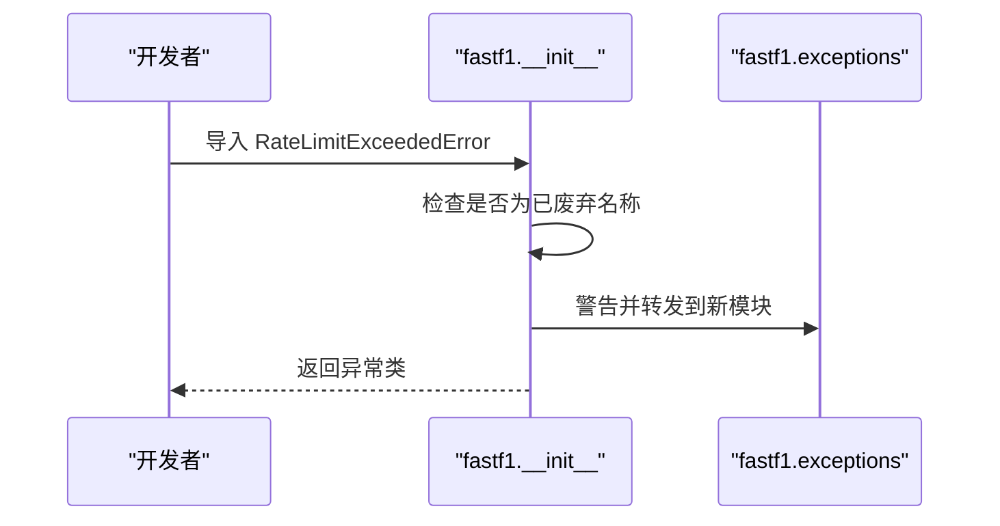
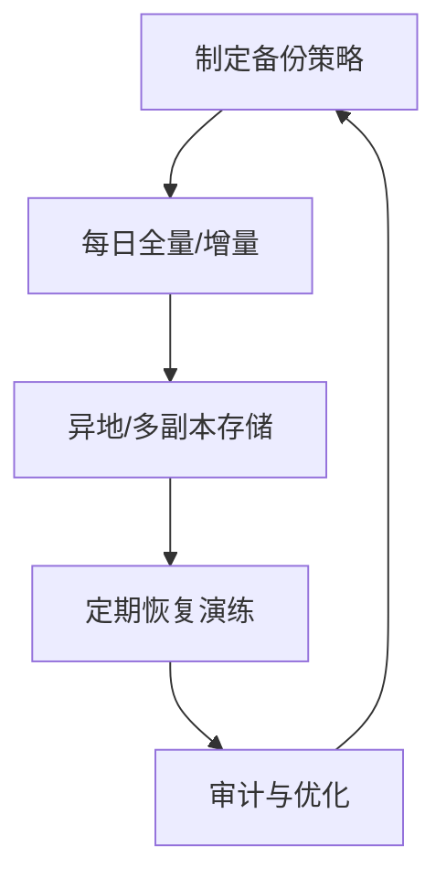
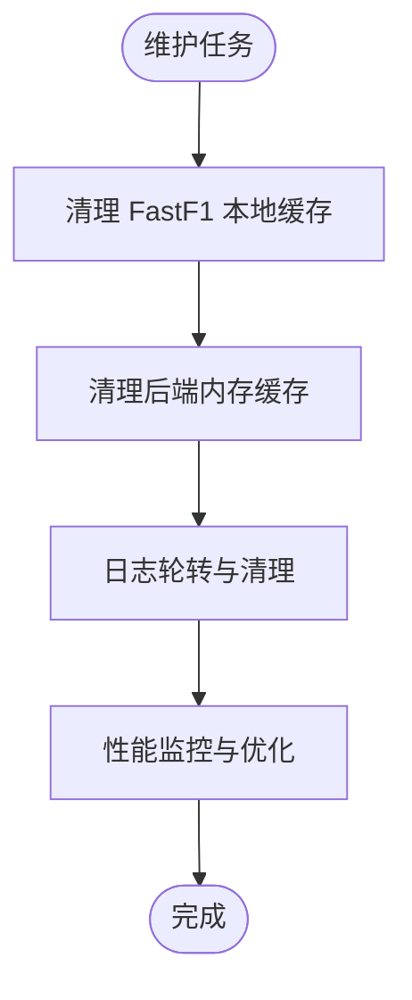
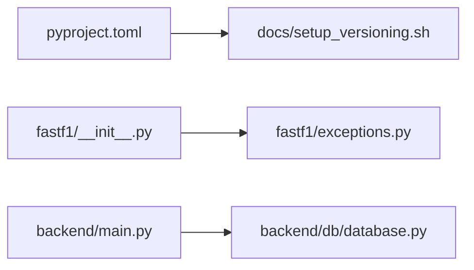

# 维护和升级

<cite>
**本文引用的文件**
- [README.md](file://README.md)
- [pyproject.toml](file://pyproject.toml)
- [backend/main.py](file://backend/main.py)
- [backend/db/database.py](file://backend/db/database.py)
- [backend/start.sh](file://backend/start.sh)
- [memory/architecture.md](file://memory/architecture.md)
- [docs/changelog/current.rst](file://docs/changelog/current.rst)
- [docs/changelog/v3.7.x.rst](file://docs/changelog/v3.7.x.rst)
- [docs/setup_versioning.sh](file://docs/setup_versioning.sh)
- [fastf1/__init__.py](file://fastf1/__init__.py)
- [fastf1/exceptions.py](file://fastf1/exceptions.py)
- [.claude/settings.local.json](file://.claude/settings.local.json)
- [draft/踩坑记录.md](file://draft/踩坑记录.md)
</cite>

## 目录
1. [简介](#简介)
2. [项目结构](#项目结构)
3. [核心组件](#核心组件)
4. [架构总览](#架构总览)
5. [详细组件分析](#详细组件分析)
6. [依赖关系分析](#依赖关系分析)
7. [性能考量](#性能考量)
8. [故障排查指南](#故障排查指南)
9. [结论](#结论)
10. [附录](#附录)

## 简介
本指南面向 Fast-F1 项目的维护与升级团队，提供一套系统化的版本管理、数据迁移、兼容性处理、备份与恢复、系统维护任务、升级准备与验证、回滚与应急处理方案。文档基于仓库现有实现与文档进行归纳总结，帮助在生产环境中安全、可追溯地推进迭代。

## 项目结构
- 后端服务（FastAPI）位于 backend/，包含路由、数据库层、服务封装与启动脚本。
- 文档与版本信息位于 docs/，包含变更日志与版本化文档构建脚本。
- 前端小程序位于 miniprogram/，与后端通过 API 交互。
- 核心库位于 fastf1/，提供数据访问、可视化与缓存能力。
- 维护与运维相关脚本与记录位于 memory/、draft/ 与 .claude/。



**图示来源**
- [backend/main.py:1-157](file://backend/main.py#L1-L157)
- [backend/db/database.py:1-1416](file://backend/db/database.py#L1-L1416)
- [backend/start.sh:1-25](file://backend/start.sh#L1-L25)
- [fastf1/__init__.py:1-40](file://fastf1/__init__.py#L1-L40)
- [fastf1/exceptions.py:1-104](file://fastf1/exceptions.py#L1-L104)
- [docs/changelog/current.rst:1-95](file://docs/changelog/current.rst#L1-L95)
- [docs/setup_versioning.sh:1-70](file://docs/setup_versioning.sh#L1-L70)

**章节来源**
- [README.md:1-75](file://README.md#L1-L75)
- [backend/main.py:1-157](file://backend/main.py#L1-L157)
- [backend/db/database.py:1-1416](file://backend/db/database.py#L1-L1416)
- [backend/start.sh:1-25](file://backend/start.sh#L1-L25)
- [memory/architecture.md:1-197](file://memory/architecture.md#L1-L197)
- [docs/changelog/current.rst:1-95](file://docs/changelog/current.rst#L1-L95)
- [docs/changelog/v3.7.x.rst:1-34](file://docs/changelog/v3.7.x.rst#L1-L34)
- [docs/setup_versioning.sh:1-70](file://docs/setup_versioning.sh#L1-L70)
- [fastf1/__init__.py:1-40](file://fastf1/__init__.py#L1-L40)
- [fastf1/exceptions.py:1-104](file://fastf1/exceptions.py#L1-L104)

## 核心组件
- 版本与发布：通过 pyproject.toml 动态版本与 hatch-vcs 配置，结合 docs/setup_versioning.sh 实现文档版本化与切换。
- 数据库层：SQLite 表结构定义与初始化，包含资讯、分析、分区、用户、帖子、评论、术语、点赞等表。
- 后端服务：FastAPI 应用，包含 CORS、路由、定时任务、缓存预热与优雅启停。
- 核心库：版本号导出、异常体系迁移至 fastf1.exceptions，向后兼容警告。
- 文档与变更：变更日志按版本组织，支持文档多版本展示与切换。

**章节来源**
- [pyproject.toml:1-136](file://pyproject.toml#L1-L136)
- [docs/setup_versioning.sh:1-70](file://docs/setup_versioning.sh#L1-L70)
- [backend/db/database.py:26-159](file://backend/db/database.py#L26-L159)
- [backend/main.py:18-157](file://backend/main.py#L18-L157)
- [fastf1/__init__.py:1-40](file://fastf1/__init__.py#L1-L40)
- [fastf1/exceptions.py:1-104](file://fastf1/exceptions.py#L1-L104)
- [docs/changelog/current.rst:1-95](file://docs/changelog/current.rst#L1-L95)

## 架构总览
后端服务通过 FastAPI 提供统一入口，内部集成 SQLite 数据库存储业务数据，使用 FastF1 缓存与本地缓存提升性能。定时任务负责新闻采集与缓存预热，启动脚本负责环境变量注入与进程托管。



**图示来源**
- [backend/main.py:18-157](file://backend/main.py#L18-L157)
- [backend/start.sh:1-25](file://backend/start.sh#L1-L25)
- [memory/architecture.md:131-197](file://memory/architecture.md#L131-L197)

## 详细组件分析

### 版本管理与发布策略
- 版本来源：动态版本由 hatch-vcs 从 VCS 获取，版本方案与回退版本在 pyproject.toml 中配置。
- 文档版本化：docs/setup_versioning.sh 自动将当前/新增版本内容归档到 versions 子目录，并生成版本切换 JSON。
- 发布节奏：变更日志按版本维护，当前版本与历史版本清晰分离，便于追踪与回溯。



**图示来源**
- [pyproject.toml:55-87](file://pyproject.toml#L55-L87)
- [docs/setup_versioning.sh:12-70](file://docs/setup_versioning.sh#L12-L70)
- [docs/changelog/current.rst:1-95](file://docs/changelog/current.rst#L1-L95)

**章节来源**
- [pyproject.toml:55-87](file://pyproject.toml#L55-L87)
- [docs/setup_versioning.sh:12-70](file://docs/setup_versioning.sh#L12-L70)
- [docs/changelog/current.rst:1-95](file://docs/changelog/current.rst#L1-L95)

### 数据迁移流程（数据库结构变更与数据格式升级）
- 结构变更：DDL 中定义了资讯、分析、分区、用户、帖子、评论、术语、点赞、车手评分与评论等表，索引与约束明确。
- 初始化幂等：init_db() 执行 DDL 与默认分区插入，支持重复调用。
- 数据格式升级：术语表 terms 支持按年份与状态扩展，便于未来引入新术语与级别。
- 建议流程：
  - 变更前：备份 f1.db 与相关缓存。
  - 变更时：在维护窗口执行 DDL，使用 INSERT OR IGNORE/REPLACE 保证幂等。
  - 变更后：校验索引与默认数据完整性，运行基础查询验证。

```mermaid
erDiagram
NEWS {
integer id PK
text title
text summary
text url UK
text source
integer published_at
integer created_at
}
NEWS_ANALYSIS {
integer id PK
integer news_id UK FK
text tech_points
text plain_explain
text race_impact
text raw_report
integer created_at
}
SECTIONS {
integer id PK
text type
text name
text slug UK
integer sort_order
}
USERS {
text openid PK
text nickname
text avatar_url
integer created_at
}
POSTS {
integer id PK
integer section_id FK
integer news_id FK
text title
text content
text author_openid
text author_nickname
text status
integer is_seeded
integer view_count
integer comment_count
integer created_at
integer updated_at
}
COMMENTS {
integer id PK
integer post_id FK
text content
text author_openid
text author_nickname
text status
integer created_at
}
TERMS {
integer id PK
text slug UK
text name_zh
text name_en
text aliases
text short_def
text full_def
text example
text category
integer level
text related_slugs
integer spec_year
text status
text submitted_by
integer created_at
}
POST_LIKES {
integer id PK
integer post_id FK
text openid
text type
integer created_at
}
DRIVER_RATINGS {
integer id PK
text driver_code
text openid
integer speed
integer consist
integer defend
integer wet
integer mental
integer created_at
}
DRIVER_COMMENTS {
integer id PK
text driver_code
text content
text author_openid
text author_nickname
integer likes
integer created_at
}
NEWS_ANALYSIS }o--|| NEWS : "1:1"
POSTS }o--|| SECTIONS : "belongs to"
COMMENTS }o--|| POSTS : "belongs to"
POST_LIKES }o--|| POSTS : "votes on"
DRIVER_RATINGS }o--|| POSTS : "optional relation"
DRIVER_COMMENTS }o--|| POSTS : "optional relation"
```

**图示来源**
- [backend/db/database.py:26-159](file://backend/db/database.py#L26-L159)

**章节来源**
- [backend/db/database.py:204-231](file://backend/db/database.py#L204-L231)
- [backend/db/database.py:26-159](file://backend/db/database.py#L26-L159)

### 兼容性处理指南（向后兼容与废弃清理）
- 异常迁移：自 v3.8.0 起，异常统一迁移到 fastf1.exceptions，原路径导入保留警告，两小版本后移除。
- 导出兼容：fastf1/__init__.py 对部分异常保留向后兼容警告，提示使用新路径。
- 建议策略：
  - 升级前：扫描第三方/内部代码导入路径，替换为新位置。
  - 升级后：观察警告日志，逐步清理旧导入。
  - 废弃清理：在计划的废弃周期后移除旧导入与兼容分支。



**图示来源**
- [fastf1/__init__.py:29-40](file://fastf1/__init__.py#L29-L40)
- [fastf1/exceptions.py:84-86](file://fastf1/exceptions.py#L84-L86)

**章节来源**
- [fastf1/__init__.py:29-40](file://fastf1/__init__.py#L29-L40)
- [fastf1/exceptions.py:1-104](file://fastf1/exceptions.py#L1-L104)
- [docs/changelog/current.rst:81-95](file://docs/changelog/current.rst#L81-L95)

### 备份与恢复策略
- 数据库备份：定期导出 SQLite 文件（f1.db），建议包含 WAL 日志模式下的检查点与一致性校验。
- 增量备份：结合文件系统快照或数据库层增量导出，缩短 RPO。
- 灾难恢复演练：定期验证备份文件可恢复性，模拟故障切换路径。
- 运维脚本参考：.claude/settings.local.json 中包含 rsync 与 systemd 管理命令，可用于远程推送与服务重启。



**图示来源**
- [.claude/settings.local.json:151-170](file://.claude/settings.local.json#L151-L170)

**章节来源**
- [.claude/settings.local.json:151-170](file://.claude/settings.local.json#L151-L170)

### 系统维护任务
- 缓存清理：FastF1 本地缓存目录与后端内存缓存定期清理，避免磁盘与内存膨胀。
- 日志清理：按时间与大小轮转，保留必要诊断信息。
- 性能优化：内存缓存、并行请求、避免嵌套遍历等已在架构文档中给出实践。



**图示来源**
- [memory/architecture.md:131-197](file://memory/architecture.md#L131-L197)

**章节来源**
- [memory/architecture.md:131-197](file://memory/architecture.md#L131-L197)

### 升级前准备与升级后验证
- 升级前准备：
  - 检查依赖版本与 Python 最低版本要求。
  - 备份数据库与关键配置。
  - 在测试环境验证变更日志中的破坏性变更与修复项。
- 升级后验证：
  - 启动服务，检查定时任务与缓存预热。
  - 调用关键接口（事件、积分榜、遥测、AI 分析）验证功能。
  - 观察异常与警告日志，确认兼容性迁移无遗留问题。

**章节来源**
- [pyproject.toml:27-44](file://pyproject.toml#L27-L44)
- [docs/changelog/current.rst:1-95](file://docs/changelog/current.rst#L1-L95)
- [backend/main.py:117-157](file://backend/main.py#L117-L157)

### 回滚机制与应急处理
- 回滚机制：
  - 通过版本标签快速回退到上一个稳定版本。
  - 数据库回滚：使用备份文件替换当前 f1.db。
  - 配置回滚：保留最近一次变更前的 .env 与配置文件。
- 应急处理：
  - 启动脚本与 systemd 管理命令可用于快速重启服务。
  - 前端问题可通过小程序缓存与静态资源 CDN 辅助快速恢复。

**章节来源**
- [.claude/settings.local.json:151-170](file://.claude/settings.local.json#L151-L170)
- [backend/start.sh:1-25](file://backend/start.sh#L1-25)

## 依赖关系分析
- 版本来源与文档版本化：pyproject.toml 动态版本与 hatch-vcs，docs/setup_versioning.sh 组织多版本文档。
- 核心库与异常：fastf1/__init__.py 与 fastf1/exceptions.py 的异常迁移路径。
- 后端与数据库：backend/main.py 初始化数据库与定时任务，backend/db/database.py 定义 DDL 与 CRUD。



**图示来源**
- [pyproject.toml:55-87](file://pyproject.toml#L55-L87)
- [docs/setup_versioning.sh:12-70](file://docs/setup_versioning.sh#L12-L70)
- [fastf1/__init__.py:1-40](file://fastf1/__init__.py#L1-L40)
- [fastf1/exceptions.py:1-104](file://fastf1/exceptions.py#L1-L104)
- [backend/main.py:18-157](file://backend/main.py#L18-L157)
- [backend/db/database.py:26-159](file://backend/db/database.py#L26-L159)

**章节来源**
- [pyproject.toml:55-87](file://pyproject.toml#L55-L87)
- [docs/setup_versioning.sh:12-70](file://docs/setup_versioning.sh#L12-L70)
- [fastf1/__init__.py:1-40](file://fastf1/__init__.py#L1-L40)
- [fastf1/exceptions.py:1-104](file://fastf1/exceptions.py#L1-L104)
- [backend/main.py:18-157](file://backend/main.py#L18-L157)
- [backend/db/database.py:26-159](file://backend/db/database.py#L26-L159)

## 性能考量
- 前端缓存：小程序采用 stale-while-revalidate 模式，不同接口设置不同 TTL，显著降低请求延迟。
- 后端缓存：服务端内存 TTL 缓存与并行 HTTP 请求，减少等待时间。
- 数据库优化：WAL 模式、外键启用、关键索引，保障并发与查询性能。

**章节来源**
- [memory/architecture.md:115-197](file://memory/architecture.md#L115-L197)

## 故障排查指南
- 小程序真机调试：记录了 input 文字颜色、页面跳转、懒加载配置等问题与修复方法，有助于快速定位前端异常。
- 后端运维：.claude/settings.local.json 提供 rsync 与 systemd 管理命令，便于远程推送与服务重启。

**章节来源**
- [draft/踩坑记录.md:1-67](file://draft/踩坑记录.md#L1-L67)
- [.claude/settings.local.json:151-170](file://.claude/settings.local.json#L151-L170)

## 结论
本指南基于仓库现有实现，总结了版本管理、数据迁移、兼容性处理、备份恢复、系统维护与应急回滚的实践路径。建议在每次升级前严格执行备份与验证流程，并持续优化缓存与性能策略，确保系统在高并发场景下的稳定性与可维护性。

## 附录
- 变更日志：按版本组织，包含依赖变更、新特性、修复与弃用说明。
- 文档版本化：支持多版本文档浏览与切换，便于用户与维护团队查阅历史信息。

**章节来源**
- [docs/changelog/current.rst:1-95](file://docs/changelog/current.rst#L1-L95)
- [docs/changelog/v3.7.x.rst:1-34](file://docs/changelog/v3.7.x.rst#L1-L34)
- [docs/setup_versioning.sh:1-70](file://docs/setup_versioning.sh#L1-L70)