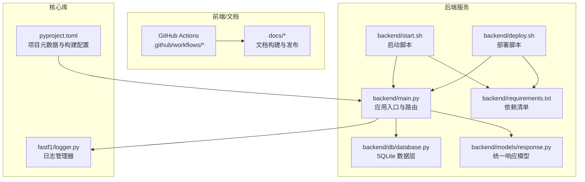
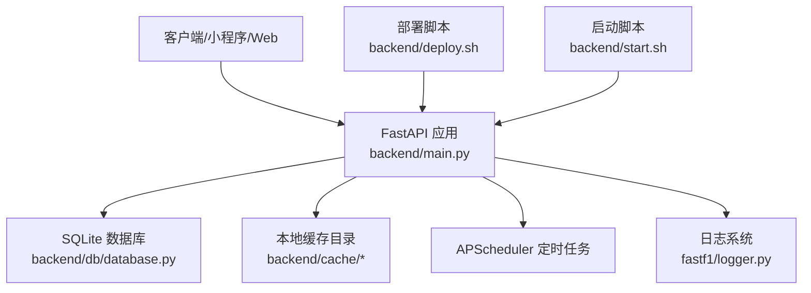
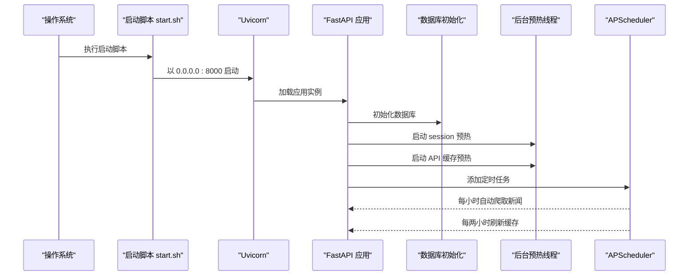
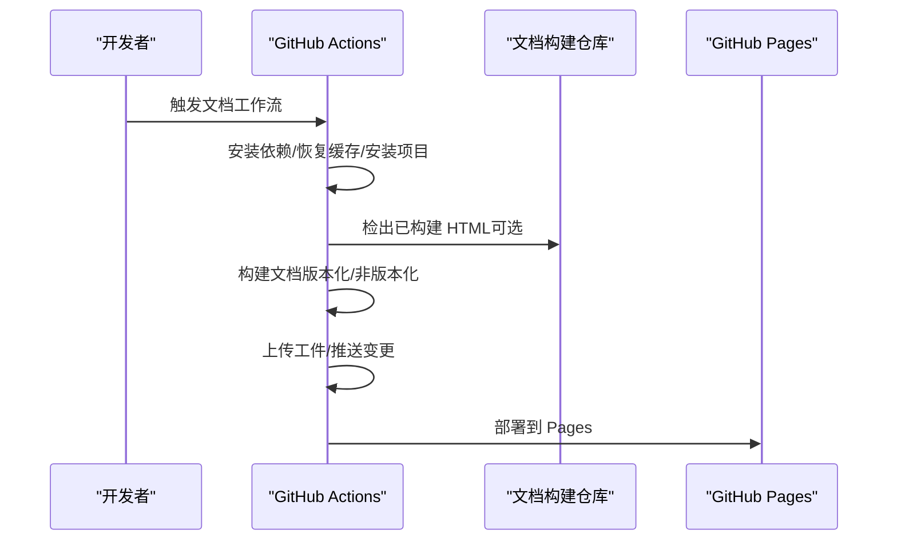
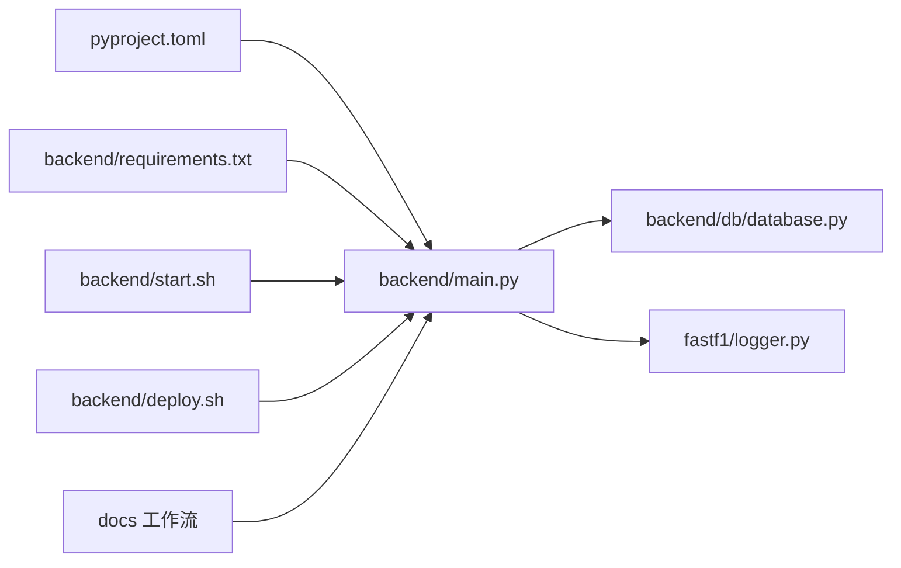

# 部署和运维

<cite>
**本文引用的文件**   
- [backend/main.py](file://backend/main.py)
- [backend/start.sh](file://backend/start.sh)
- [backend/deploy.sh](file://backend/deploy.sh)
- [backend/requirements.txt](file://backend/requirements.txt)
- [backend/db/database.py](file://backend/db/database.py)
- [backend/models/response.py](file://backend/models/response.py)
- [backend/routers/admin.py](file://backend/routers/admin.py)
- [backend/routers/news.py](file://backend/routers/news.py)
- [.github/workflows/docs.yml](file://.github/workflows/docs.yml)
- [.github/workflows/docs_ext_deploy.yml](file://.github/workflows/docs_ext_deploy.yml)
- [pyproject.toml](file://pyproject.toml)
- [fastf1/logger.py](file://fastf1/logger.py)
</cite>

## 更新摘要
**所做更改**   
- 新增后端部署脚本（deploy.sh）的完整部署流程文档
- 更新启动脚本（start.sh）的详细说明和使用指南
- 完善部署配置清单，包含服务器配置、环境变量和备份策略
- 新增生产环境部署最佳实践和运维自动化建议
- 扩展监控和日志配置，包含错误追踪和性能监控方案

## 目录
1. [简介](#简介)
2. [项目结构](#项目结构)
3. [核心组件](#核心组件)
4. [架构总览](#架构总览)
5. [详细组件分析](#详细组件分析)
6. [依赖关系分析](#依赖关系分析)
7. [性能考量](#性能考量)
8. [故障排除指南](#故障排除指南)
9. [结论](#结论)
10. [附录](#附录)

## 简介
本文件面向 Fast-F1 项目的后端服务（FastAPI 应用）与周边运维场景，提供全面的部署与运维指南。内容覆盖生产环境配置、Docker 部署建议、CI/CD 流程、服务器配置、监控与日志、备份与恢复、维护与升级、高可用与负载均衡、以及运维自动化脚本与工具。文档严格基于仓库现有文件进行分析与总结，特别新增了完整的后端部署脚本和启动脚本的详细说明。

## 项目结构
后端服务位于 backend 目录，核心入口为 FastAPI 应用，包含数据库初始化、定时任务、CORS 中间件、静态缓存目录配置、以及多个路由模块。部署脚本负责远程服务器备份、代码同步和进程重启。启动脚本负责本地开发环境的快速启动。数据库层采用 SQLite，具备基础的 DDL、索引与常用 CRUD 方法。日志系统来自 fastf1 子包中的 logger 模块。



**图表来源**
- [backend/main.py:1-185](file://backend/main.py#L1-L185)
- [backend/start.sh:1-25](file://backend/start.sh#L1-L25)
- [backend/deploy.sh:1-27](file://backend/deploy.sh#L1-L27)
- [backend/requirements.txt:1-18](file://backend/requirements.txt#L1-L18)
- [backend/db/database.py:1-200](file://backend/db/database.py#L1-L200)
- [backend/models/response.py:1-14](file://backend/models/response.py#L1-L14)
- [.github/workflows/docs.yml:1-196](file://.github/workflows/docs.yml#L1-L196)
- [.github/workflows/docs_ext_deploy.yml:1-53](file://.github/workflows/docs_ext_deploy.yml#L1-L53)
- [fastf1/logger.py:1-125](file://fastf1/logger.py#L1-L125)
- [pyproject.toml:1-136](file://pyproject.toml#L1-L136)

**章节来源**
- [backend/main.py:1-185](file://backend/main.py#L1-L185)
- [backend/start.sh:1-25](file://backend/start.sh#L1-L25)
- [backend/deploy.sh:1-27](file://backend/deploy.sh#L1-L27)
- [backend/requirements.txt:1-18](file://backend/requirements.txt#L1-L18)
- [backend/db/database.py:1-200](file://backend/db/database.py#L1-L200)
- [backend/models/response.py:1-14](file://backend/models/response.py#L1-L14)
- [.github/workflows/docs.yml:1-196](file://.github/workflows/docs.yml#L1-L196)
- [.github/workflows/docs_ext_deploy.yml:1-53](file://.github/workflows/docs_ext_deploy.yml#L1-L53)
- [fastf1/logger.py:1-125](file://fastf1/logger.py#L1-L125)
- [pyproject.toml:1-136](file://pyproject.toml#L1-L136)

## 核心组件
- 应用入口与路由
  - 初始化 CORS、数据库、定时任务与后台预热线程。
  - 定义统一根路径与跳转接口。
  - 新增资讯、论坛、管理员、术语、车手、热门、精选内容、聊天室等路由模块。
- 启动脚本
  - 自动创建缓存目录、加载 .env、以 Uvicorn 监听 0.0.0.0:8000。
- 部署脚本
  - 远程服务器备份、rsync 同步、systemctl 重启服务。
- 数据库层
  - SQLite，包含资讯、AI 分析、论坛分区、用户、帖子、评论、点赞、术语、车手评分等表及索引。
- 统一响应模型
  - 提供标准响应结构与便捷构造函数。
- 日志系统
  - fastf1 的 LoggingManager 提供控制台格式化输出与级别设置，支持调试模式开关。

**章节来源**
- [backend/main.py:1-185](file://backend/main.py#L1-L185)
- [backend/start.sh:1-25](file://backend/start.sh#L1-L25)
- [backend/deploy.sh:1-27](file://backend/deploy.sh#L1-L27)
- [backend/db/database.py:1-200](file://backend/db/database.py#L1-L200)
- [backend/models/response.py:1-14](file://backend/models/response.py#L1-L14)
- [fastf1/logger.py:1-125](file://fastf1/logger.py#L1-L125)

## 架构总览
后端服务采用 FastAPI + Uvicorn，数据库为本地 SQLite 文件。应用启动时进行数据库初始化、定时任务调度与后台缓存预热。部署脚本提供完整的远程部署流程，包括自动备份、代码同步和进程重启。文档构建与发布通过 GitHub Actions 实现，支持版本化与非版本化构建、外部仓库推送与 GitHub Pages 部署。



**图表来源**
- [backend/main.py:1-185](file://backend/main.py#L1-L185)
- [backend/db/database.py:1-200](file://backend/db/database.py#L1-L200)
- [backend/deploy.sh:1-27](file://backend/deploy.sh#L1-L27)
- [backend/start.sh:1-25](file://backend/start.sh#L1-L25)
- [fastf1/logger.py:1-125](file://fastf1/logger.py#L1-L125)

## 详细组件分析

### 应用入口与路由（backend/main.py）
- 功能要点
  - 初始化缓存目录并启用 fastf1 缓存。
  - 配置 CORS（允许任意源/方法/头）。
  - 注册事件、排位、单圈、遥测、分析、积分榜、新闻、论坛、管理、条款、车手、热门、精选内容、聊天室等路由。
  - 启动时初始化数据库并启动定时任务与后台预热。
  - 提供根路径与跳转接口。
- 关键流程
  - 启动事件：初始化数据库、后台线程预热、定时任务调度。
  - 关闭事件：优雅关闭调度器。
  - 定时任务：每小时自动爬取新闻；每两小时刷新 API 缓存。
  - 预热：加载历史 session 至内存、拉取 events/standings 填充缓存。



**图表来源**
- [backend/start.sh:1-25](file://backend/start.sh#L1-L25)
- [backend/main.py:141-161](file://backend/main.py#L141-L161)

**章节来源**
- [backend/main.py:1-185](file://backend/main.py#L1-L185)

### 启动脚本（backend/start.sh）
- 功能要点
  - 创建 cache 与 analysis 子目录。
  - 从 .env 加载环境变量。
  - 以 Uvicorn 运行 main:app，监听 0.0.0.0:8000。
- 运维建议
  - 生产环境建议使用 systemd 或容器编排替代直接 shell 启动。
  - .env 中可配置数据库连接字符串、第三方服务凭据等（需结合实际实现扩展）。

**章节来源**
- [backend/start.sh:1-25](file://backend/start.sh#L1-L25)

### 部署脚本（backend/deploy.sh）
- 功能要点
  - 远程服务器数据库自动备份（带时间戳）。
  - rsync 同步代码，排除缓存和数据库文件。
  - 通过 SSH 远程重启 systemd 服务。
- 部署流程
  - 步骤1：备份服务器数据库文件
  - 步骤2：同步本地代码到远程服务器
  - 步骤3：重启服务并检查状态
- 运维建议
  - 部署前确保 SSH 密钥配置正确。
  - 建议在维护窗口执行部署操作。

**章节来源**
- [backend/deploy.sh:1-27](file://backend/deploy.sh#L1-L27)

### 依赖清单（backend/requirements.txt）
- 核心依赖
  - FastAPI、Uvicorn、fastf1、pandas、numpy、openai、requests、requests-cache、httpx、apscheduler、scipy、feedparser、trafilatura、beautifulsoup4、lxml、playwright。
- 版本约束
  - 严格遵循各库版本范围，确保兼容性与稳定性。

**章节来源**
- [backend/requirements.txt:1-18](file://backend/requirements.txt#L1-L18)

### 数据库层（backend/db/database.py）
- 表结构概览
  - 资讯 news、AI 分析 news_analysis、分区 sections、用户 users、帖子 posts、评论 comments、点赞/点踩 post_likes、术语 terms、车手评分 driver_ratings、车手评论 driver_comments、精选内容 curated_content、聊天室消息 chat_messages。
- 设计特点
  - 使用 WAL 模式提升并发写入安全性。
  - 多处索引优化查询性能。
  - 提供常用 CRUD 与聚合查询（如热门推荐）。
- 运维要点
  - SQLite 文件路径固定，注意磁盘空间与权限。
  - 备份应复制 f1.db 文件与 analysis 缓存目录。

```mermaid
erDiagram
NEWS {
int id PK
text title
text summary
text url UK
text source
int published_at
int created_at
}
NEWS_ANALYSIS {
int id PK
int news_id UK FK
text tech_points
text plain_explain
text race_impact
text raw_report
int created_at
}
SECTIONS {
int id PK
text type
text name
text slug UK
int sort_order
}
USERS {
text openid PK
text nickname
text avatar_url
int created_at
}
POSTS {
int id PK
int section_id FK
int news_id FK
text title
text content
text author_openid
text author_nickname
text status
int is_seeded
int view_count
int comment_count
int created_at
int updated_at
}
COMMENTS {
int id PK
int post_id FK
text content
text author_openid
text author_nickname
text status
int created_at
}
POST_LIKES {
int id PK
int post_id FK
text openid
text type
int created_at
}
TERMS {
int id PK
text slug UK
text name_zh
text name_en
text aliases
text short_def
text full_def
text example
text category
int level
text related_slugs
int spec_year
text status
text submitted_by
int created_at
}
DRIVER_RATINGS {
int id PK
text driver_code
text openid
int speed
int consist
int defend
int wet
int mental
int created_at
}
DRIVER_COMMENTS {
int id PK
text driver_code
text content
text author_openid
text author_nickname
int likes
int created_at
}
CURATED_CONTENT {
int id PK
text url UK
text title
text summary
text cover_image
text platform
text content_type
text tags
text note
text submitted_by
text archived_html
text snapshot_image
int published_at
int created_at
int analyzed
text tech_points
text plain_explain
text race_impact
text analyzed_at
}
CHAT_MESSAGES {
int id PK
text nickname
text content
timestamp created_at
}
NEWS ||--o{ NEWS_ANALYSIS : "1:1"
SECTIONS ||--o{ POSTS : "1:N"
USERS ||--o{ POSTS : "1:N"
POSTS ||--o{ COMMENTS : "1:N"
POSTS ||--o{ POST_LIKES : "1:N"
NEWS ||--o{ POSTS : "1:N"
```

**图表来源**
- [backend/db/database.py:30-200](file://backend/db/database.py#L30-L200)

**章节来源**
- [backend/db/database.py:1-200](file://backend/db/database.py#L1-L200)

### 统一响应模型（backend/models/response.py）
- 提供统一的 API 响应结构与便捷构造函数，便于前后端一致性处理。

**章节来源**
- [backend/models/response.py:1-14](file://backend/models/response.py#L1-L14)

### 管理员路由（backend/routers/admin.py）
- 功能要点
  - 管理员鉴权：通过 X-Admin-Token 头部进行权限验证。
  - 帖子审核：待审核帖子列表、通过/拒绝审核。
  - 评论审核：待审核评论列表、通过/拒绝审核。
  - 爬虫控制：触发爬虫 + AI 分析、只爬取不分析、单条分析。
  - 术语审核：待审核用户提交术语列表、批准/拒绝。
- 安全特性
  - 默认管理员令牌：f1admin2026（需在生产环境修改）。
  - 所有操作均需有效的管理员令牌。

**章节来源**
- [backend/routers/admin.py:1-245](file://backend/routers/admin.py#L1-L245)

### 资讯路由（backend/routers/news.py）
- 功能要点
  - 资讯列表：分页查询，支持车队过滤和关键词搜索。
  - 资讯详情：获取资讯详情，包含 AI 三段式分析。
  - 车队标签：从新闻内容中匹配车队标签。
  - 关联帖子：获取关联的论坛帖子列表。
  - AI 分析：用户触发 AI 分析、管理员手动分析。
  - 爬虫控制：管理员手动触发爬虫。
- 性能优化
  - 车队标签内存缓存（10分钟TTL）。
  - 异步 AI 分析处理，避免阻塞主线程。

**章节来源**
- [backend/routers/news.py:1-205](file://backend/routers/news.py#L1-L205)

### 文档构建与发布（.github/workflows/docs.yml 与 docs_ext_deploy.yml）
- 构建流程
  - 安装 Python 与依赖、创建缓存目录、恢复文档缓存、安装项目、构建 HTML 或版本化文档。
  - 支持从外部仓库检出已构建产物、上传为工件、推送变更到外部仓库、部署到 GitHub Pages。
- 触发条件
  - 支持手动触发、发布事件、分支推送、工作流调用等。



**图表来源**
- [.github/workflows/docs.yml:58-196](file://.github/workflows/docs.yml#L58-L196)
- [.github/workflows/docs_ext_deploy.yml:8-53](file://.github/workflows/docs_ext_deploy.yml#L8-L53)

**章节来源**
- [.github/workflows/docs.yml:1-196](file://.github/workflows/docs.yml#L1-L196)
- [.github/workflows/docs_ext_deploy.yml:1-53](file://.github/workflows/docs_ext_deploy.yml#L1-L53)

### 日志系统（fastf1/logger.py）
- 功能要点
  - 提供根日志器、控制台格式化输出、级别设置、子日志器获取、软异常包装器。
  - 支持通过环境变量切换调试模式，影响异常捕获策略。
- 运维建议
  - 生产环境建议将日志输出重定向到文件或集中式日志系统，避免仅输出到控制台。

**章节来源**
- [fastf1/logger.py:1-125](file://fastf1/logger.py#L1-L125)

## 依赖关系分析
- 组件耦合
  - main.py 依赖数据库层、定时任务、缓存配置与路由模块。
  - 启动脚本依赖 requirements.txt 与 .env。
  - 部署脚本依赖远程服务器配置。
  - 文档工作流依赖项目构建配置与外部仓库。
- 外部依赖
  - Python 版本要求与依赖范围由 pyproject.toml 约束。
  - 后端依赖通过 requirements.txt 明确版本。



**图表来源**
- [pyproject.toml:1-136](file://pyproject.toml#L1-L136)
- [backend/requirements.txt:1-18](file://backend/requirements.txt#L1-L18)
- [backend/main.py:1-185](file://backend/main.py#L1-L185)
- [backend/start.sh:1-25](file://backend/start.sh#L1-L25)
- [backend/deploy.sh:1-27](file://backend/deploy.sh#L1-L27)
- [backend/db/database.py:1-200](file://backend/db/database.py#L1-L200)
- [fastf1/logger.py:1-125](file://fastf1/logger.py#L1-L125)
- [.github/workflows/docs.yml:1-196](file://.github/workflows/docs.yml#L1-L196)

**章节来源**
- [pyproject.toml:1-136](file://pyproject.toml#L1-L136)
- [backend/requirements.txt:1-18](file://backend/requirements.txt#L1-L18)
- [backend/main.py:1-185](file://backend/main.py#L1-L185)
- [backend/start.sh:1-25](file://backend/start.sh#L1-L25)
- [backend/deploy.sh:1-27](file://backend/deploy.sh#L1-L27)
- [backend/db/database.py:1-200](file://backend/db/database.py#L1-L200)
- [fastf1/logger.py:1-125](file://fastf1/logger.py#L1-L125)
- [.github/workflows/docs.yml:1-196](file://.github/workflows/docs.yml#L1-L196)

## 性能考量
- 缓存与预热
  - fastf1 缓存目录启用，启动时后台线程加载历史 session 至内存，减少首次请求延迟。
  - 预热 events 与 standings API，提升热点数据访问性能。
  - 车队标签内存缓存（10分钟TTL），减少重复计算。
- 数据库优化
  - WAL 模式与索引设计有助于并发写入与查询效率。
  - 多表关联查询优化，支持分页和条件过滤。
- 定时任务
  - 自动爬取与缓存刷新降低实时数据拉取压力。
  - 异步 AI 分析处理，避免阻塞主线程。
- 建议
  - 对高并发场景考虑引入反向代理与多进程/多实例部署。
  - 结合监控指标调整预热策略与缓存大小。

**章节来源**
- [backend/main.py:72-132](file://backend/main.py#L72-L132)
- [backend/db/database.py:17-23](file://backend/db/database.py#L17-L23)
- [backend/routers/news.py:24-35](file://backend/routers/news.py#L24-L35)

## 故障排除指南
- 启动失败
  - 检查 .env 是否正确加载、端口是否被占用、依赖是否完整安装。
  - 查看控制台输出与日志文件（如已重定向）。
- 部署失败
  - 检查 SSH 密钥配置、远程服务器连接、systemd 服务状态。
  - 确认 rsync 同步权限和排除规则。
- 数据库异常
  - 确认 f1.db 文件存在且可写，必要时重建数据库并重新初始化。
- 缓存问题
  - 清理 cache 与 analysis 目录后重启，观察是否恢复正常。
- 文档构建失败
  - 检查工作流中的依赖安装步骤、缓存命中情况与外部仓库访问权限。
- 管理员权限问题
  - 确认 ADMIN_TOKEN 环境变量配置正确。
  - 检查 X-Admin-Token 头部传递。

**章节来源**
- [backend/start.sh:16-24](file://backend/start.sh#L16-L24)
- [backend/deploy.sh:9-26](file://backend/deploy.sh#L9-L26)
- [backend/db/database.py:17-23](file://backend/db/database.py#L17-L23)
- [backend/routers/admin.py:27](file://backend/routers/admin.py#L27)

## 结论
本指南基于现有代码与工作流，给出了 Fast-F1 后端服务的完整部署与运维实践建议。新增的部署脚本提供了完整的远程部署流程，包括自动备份、代码同步和进程重启。建议在生产环境中完善容器化与编排、接入集中式日志与监控、制定备份与恢复策略，并持续优化缓存与数据库性能。文档构建与发布流程可通过 GitHub Actions 实现自动化与版本化管理。

## 附录

### 生产环境配置清单
- 系统与运行时
  - Python 版本满足项目要求（>=3.10）。
  - Uvicorn 作为 ASGI 服务器，监听 0.0.0.0:8000。
- 环境变量
  - .env 中配置数据库连接、第三方服务凭据、日志级别、管理员令牌等。
  - ADMIN_TOKEN：管理员访问令牌（需在生产环境修改默认值）。
- 目录与权限
  - cache 与 analysis 目录可写，f1.db 文件具备读写权限。
  - 部署脚本需要 SSH 密钥访问远程服务器。
- 安全
  - CORS 当前允许任意源，生产环境建议限定来源。
  - 管理员令牌需定期轮换，使用强密码策略。
  - 如涉及认证令牌，建议通过安全渠道存储与轮换。

**章节来源**
- [pyproject.toml:27](file://pyproject.toml#L27)
- [backend/start.sh:16-24](file://backend/start.sh#L16-L24)
- [backend/main.py:35-40](file://backend/main.py#L35-L40)
- [backend/db/database.py:14](file://backend/db/database.py#L14)
- [backend/routers/admin.py:27](file://backend/routers/admin.py#L27)

### Docker 部署建议
- 基础镜像选择
  - 基于官方 Python 运行时镜像，安装依赖并复制项目代码。
- 构建与运行
  - 构建阶段安装 requirements.txt 与项目依赖。
  - 运行阶段以 Uvicorn 启动，映射 8000 端口，挂载 cache 与 f1.db 所在卷。
- 安全与网络
  - 限制容器网络访问，仅暴露必要端口。
  - 使用只读根文件系统与最小权限用户运行。
- 健康检查
  - 添加 HTTP GET / 健康检查端点。
  - 配置重启策略和资源限制。

### CI/CD 流程
- 文档构建
  - 安装依赖、恢复缓存、安装项目、构建 HTML 或版本化文档。
  - 可选：检出外部构建产物、上传工件、推送变更到外部仓库、部署到 GitHub Pages。
- 代码部署
  - 使用部署脚本自动备份、同步代码、重启服务。
  - 支持手动触发和自动化部署流程。
- 触发方式
  - 支持手动触发、发布事件、分支推送、工作流调用。

**章节来源**
- [.github/workflows/docs.yml:58-196](file://.github/workflows/docs.yml#L58-L196)
- [.github/workflows/docs_ext_deploy.yml:8-53](file://.github/workflows/docs_ext_deploy.yml#L8-L53)
- [backend/deploy.sh:1-27](file://backend/deploy.sh#L1-L27)

### 监控与日志
- 日志
  - 建议将 fastf1 日志与应用日志输出重定向到文件或集中式日志系统。
  - 配置日志轮转，避免磁盘空间不足。
- 性能监控
  - 结合 Uvicorn/ASGI 指标与数据库查询性能，建立告警阈值。
  - 监控缓存命中率、数据库连接数、API 响应时间。
- 错误追踪
  - 建议集成错误上报平台，收集异常堆栈与上下文信息。
  - 配置关键错误的邮件或消息通知。

**章节来源**
- [fastf1/logger.py:21-31](file://fastf1/logger.py#L21-L31)
- [backend/main.py:141-161](file://backend/main.py#L141-L161)

### 备份与恢复策略
- 数据备份
  - 备份 SQLite 文件 f1.db 与 analysis 缓存目录。
  - 部署脚本提供自动备份功能，带时间戳命名。
- 配置备份
  - 备份 .env 与数据库初始化脚本。
  - 备份 SSH 密钥和系统配置。
- 灾难恢复
  - 准备最小化恢复流程：恢复文件、重建依赖、启动服务、验证缓存与定时任务。
  - 测试恢复流程，确保数据完整性。

**章节来源**
- [backend/db/database.py:14](file://backend/db/database.py#L14)
- [backend/deploy.sh:9-11](file://backend/deploy.sh#L9-L11)

### 维护与升级指南
- 版本管理
  - 依据 pyproject.toml 的版本策略与依赖范围进行升级。
  - 使用语义化版本控制，标记重大变更。
- 数据迁移
  - SQLite DDL 变更需谨慎评估，建议先在测试环境验证。
  - 备份数据库后再执行迁移操作。
- 兼容性处理
  - 升级第三方库时关注 API 变更与行为差异，逐步灰度发布。
  - 测试关键功能，确保向后兼容性。

**章节来源**
- [pyproject.toml:29-44](file://pyproject.toml#L29-L44)
- [backend/requirements.txt:1-18](file://backend/requirements.txt#L1-L18)

### 负载均衡与高可用
- 建议
  - 使用反向代理（如 Nginx）与多实例部署，结合健康检查与自动扩缩容。
  - 将 SQLite 改为共享存储或外部数据库以支持多实例写入。
  - 配置会话粘性或使用无状态设计。
- 本项目现状
  - 当前为单实例与本地 SQLite，需按上述建议演进。
  - 部署脚本支持单服务器部署，多服务器部署需额外配置。

### 运维自动化脚本与工具
- 启动脚本
  - 自动创建缓存目录、加载 .env、以 Uvicorn 启动。
- 部署脚本
  - 自动备份服务器数据库、rsync 同步代码、systemctl 重启服务。
  - 支持远程服务器配置和 SSH 密钥管理。
- 建议
  - 增加健康检查、日志轮转、备份脚本与一键回滚脚本。
  - 集成监控告警和自动修复机制。
- 监控脚本
  - API 健康检查：HTTP GET / 检查服务状态。
  - 数据库监控：检查 f1.db 文件大小和连接数。
  - 缓存监控：监控 cache 目录使用情况。

**章节来源**
- [backend/start.sh:1-25](file://backend/start.sh#L1-L25)
- [backend/deploy.sh:1-27](file://backend/deploy.sh#L1-L27)
- [.github/workflows/docs.yml:126-141](file://.github/workflows/docs.yml#L126-L141)