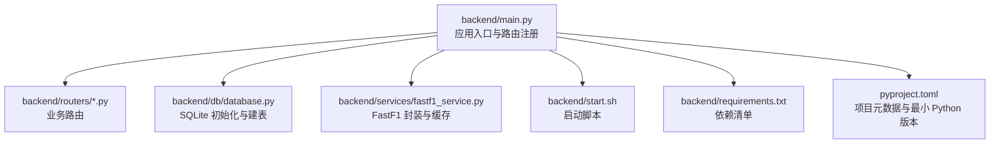
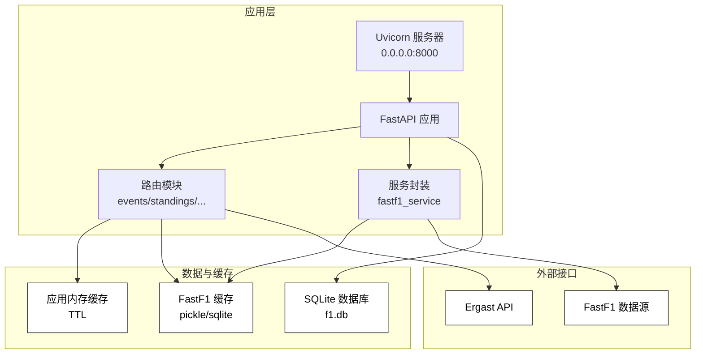
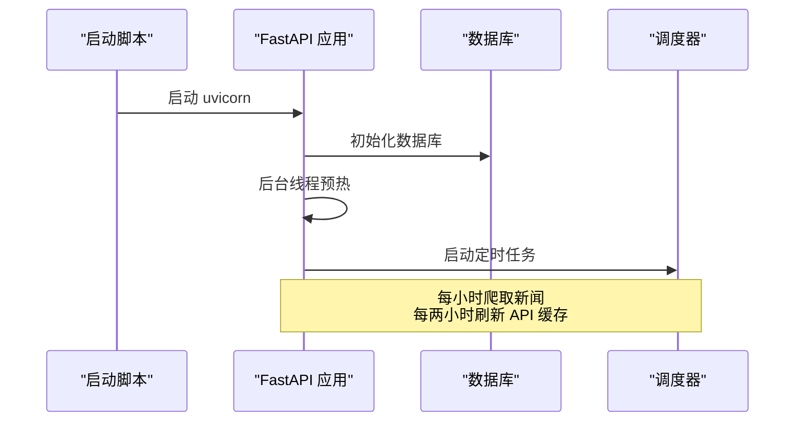
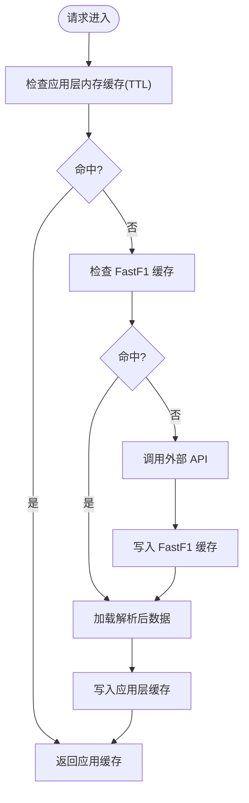
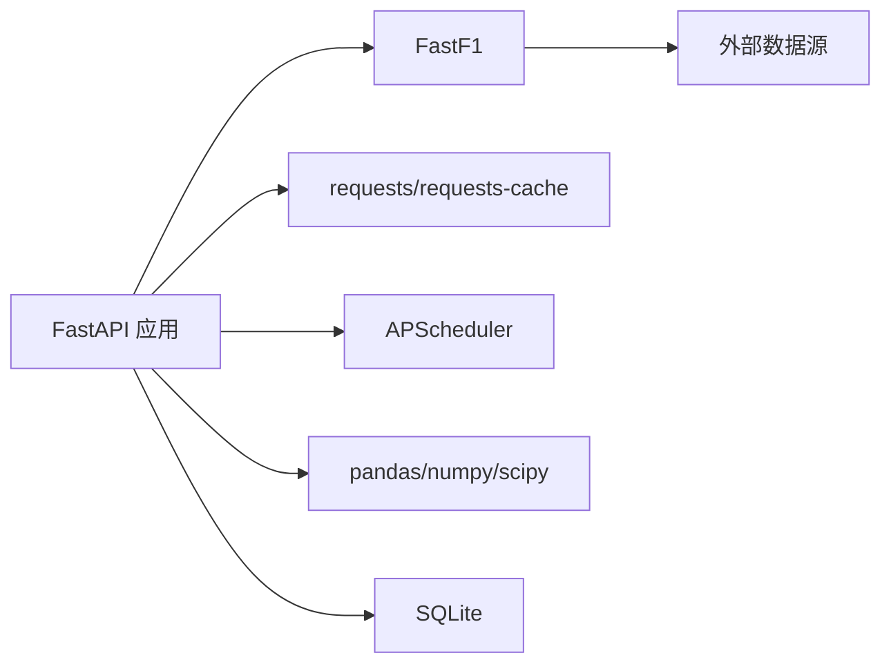

# 部署配置

<cite>
**本文引用的文件**
- [backend/main.py](file://backend/main.py)
- [backend/start.sh](file://backend/start.sh)
- [backend/requirements.txt](file://backend/requirements.txt)
- [backend/db/database.py](file://backend/db/database.py)
- [backend/services/fastf1_service.py](file://backend/services/fastf1_service.py)
- [backend/routers/events.py](file://backend/routers/events.py)
- [backend/routers/standings.py](file://backend/routers/standings.py)
- [pyproject.toml](file://pyproject.toml)
- [fastf1/req.py](file://fastf1/req.py)
</cite>

## 目录
1. [简介](#简介)
2. [项目结构](#项目结构)
3. [核心组件](#核心组件)
4. [架构总览](#架构总览)
5. [详细组件分析](#详细组件分析)
6. [依赖关系分析](#依赖关系分析)
7. [性能考虑](#性能考虑)
8. [故障排查指南](#故障排查指南)
9. [结论](#结论)
10. [附录](#附录)

## 简介
本文件面向生产环境部署 Fast-F1 后端服务，提供从环境准备、依赖安装、启动脚本到容器化与反向代理的完整配置说明。文档基于仓库中的实际代码与配置文件进行梳理，重点覆盖：
- Python 版本与依赖包安装
- 环境变量与缓存目录配置
- Docker 镜像构建与容器运行
- Nginx 反向代理与 SSL 配置
- 服务器硬件与网络要求
- 启动脚本与进程管理
- 单机、集群与云平台部署最佳实践

## 项目结构
后端服务位于 backend 目录，核心入口为 FastAPI 应用，包含数据库初始化、定时任务、缓存与路由模块。



**图表来源**
- [backend/main.py:1-157](file://backend/main.py#L1-L157)
- [backend/db/database.py:1-160](file://backend/db/database.py#L1-L160)
- [backend/services/fastf1_service.py:1-64](file://backend/services/fastf1_service.py#L1-L64)
- [backend/start.sh:1-25](file://backend/start.sh#L1-L25)
- [backend/requirements.txt:1-15](file://backend/requirements.txt#L1-L15)
- [pyproject.toml:19-24](file://pyproject.toml#L19-L24)

**章节来源**
- [backend/main.py:1-157](file://backend/main.py#L1-L157)
- [backend/db/database.py:1-160](file://backend/db/database.py#L1-L160)
- [backend/services/fastf1_service.py:1-64](file://backend/services/fastf1_service.py#L1-L64)
- [backend/start.sh:1-25](file://backend/start.sh#L1-L25)
- [backend/requirements.txt:1-15](file://backend/requirements.txt#L1-L15)
- [pyproject.toml:19-24](file://pyproject.toml#L19-L24)

## 核心组件
- 应用入口与路由
  - 注册 CORS 中间件与全部业务路由（事件、排位、圈速、遥测、分析、积分榜、新闻、论坛、术语、车手、热门等）
  - 启动时初始化数据库并启动定时任务与后台预热
- 数据库层
  - SQLite 建表与索引，包含新闻、分析、分区、用户、帖子、评论、术语、车手评分等表
  - 默认分区数据初始化
- 缓存与预热
  - FastAPI 与 FastF1 多层缓存：内存缓存、文件缓存、SQLite 请求缓存
  - 启动时后台预热 session 与 API 缓存，提升首屏响应
- 启动脚本
  - 自动创建 cache 目录，加载 .env 环境变量，通过 uvicorn 在 0.0.0.0:8000 启动

**章节来源**
- [backend/main.py:18-42](file://backend/main.py#L18-L42)
- [backend/main.py:117-136](file://backend/main.py#L117-L136)
- [backend/db/database.py:26-159](file://backend/db/database.py#L26-L159)
- [backend/start.sh:12-24](file://backend/start.sh#L12-L24)

## 架构总览
后端服务采用 FastAPI + Uvicorn，数据库为 SQLite，缓存贯穿请求与解析阶段。定时任务负责新闻爬取与缓存刷新，路由层提供多类 API。



**图表来源**
- [backend/main.py:18-42](file://backend/main.py#L18-L42)
- [backend/routers/events.py:21-53](file://backend/routers/events.py#L21-L53)
- [backend/routers/standings.py:51-61](file://backend/routers/standings.py#L51-L61)
- [backend/services/fastf1_service.py:14-21](file://backend/services/fastf1_service.py#L14-L21)
- [backend/db/database.py:10-19](file://backend/db/database.py#L10-L19)
- [fastf1/req.py:132-200](file://fastf1/req.py#L132-L200)

## 详细组件分析

### 应用启动与定时任务
- 启动流程
  - 初始化数据库
  - 后台线程预热：加载已有 session 至内存、预取 events/standings 缓存
  - 启动 APScheduler：定时爬取新闻、定时刷新 API 缓存
- 关闭流程
  - 关闭调度器，避免资源泄漏



**图表来源**
- [backend/main.py:117-136](file://backend/main.py#L117-L136)
- [backend/start.sh:22-24](file://backend/start.sh#L22-L24)

**章节来源**
- [backend/main.py:117-136](file://backend/main.py#L117-L136)
- [backend/start.sh:22-24](file://backend/start.sh#L22-L24)

### 数据库初始化与表结构
- 初始化逻辑
  - 建表与索引
  - 插入默认分区数据（幂等）
- 表结构概览
  - 新闻、分析、分区、用户、帖子、评论、术语、车手评分与评论等
  - 索引覆盖常用查询字段

```mermaid
erDiagram
NEWS {
integer id PK
text title
text summary
text url UK
text source
integer published_at
integer created_at
}
NEWS_ANALYSIS {
integer id PK
integer news_id UK FK
text tech_points
text plain_explain
text race_impact
text raw_report
integer created_at
}
SECTIONS {
integer id PK
text type
text name
text slug UK
integer sort_order
}
USERS {
text openid PK
text nickname
text avatar_url
integer created_at
}
POSTS {
integer id PK
integer section_id FK
integer news_id FK
text title
text content
text author_openid
text author_nickname
text status
integer is_seeded
integer view_count
integer comment_count
integer created_at
integer updated_at
}
COMMENTS {
integer id PK
integer post_id FK
text content
text author_openid
text author_nickname
text status
integer created_at
}
TERMS {
integer id PK
text slug UK
text name_zh
text name_en
text aliases
text short_def
text full_def
text example
text category
integer level
text related_slugs
integer spec_year
text status
text submitted_by
integer created_at
}
DRIVER_RATINGS {
integer id PK
text driver_code
text openid
integer speed
integer consist
integer defend
integer wet
integer mental
integer created_at
}
DRIVER_COMMENTS {
integer id PK
text driver_code
text content
text author_openid
text author_nickname
integer likes
integer created_at
}
NEWS ||--|| NEWS_ANALYSIS : "一对一"
SECTIONS ||--o{ POSTS : "包含"
USERS ||--o{ POSTS : "发表"
USERS ||--o{ COMMENTS : "发表"
POSTS ||--o{ COMMENTS : "包含"
```

**图表来源**
- [backend/db/database.py:26-159](file://backend/db/database.py#L26-L159)

**章节来源**
- [backend/db/database.py:204-214](file://backend/db/database.py#L204-L214)
- [backend/db/database.py:26-159](file://backend/db/database.py#L26-L159)

### 缓存与预热机制
- FastF1 缓存
  - 支持 pickle 与 requests-cache 两级缓存
  - 可通过环境变量或显式调用配置缓存目录
- 应用层缓存
  - 路由层内存缓存（TTL）
  - 启动时后台预热 session 与 API 缓存
- 服务层缓存
  - 进程级内存缓存，避免重复加载相同 session



**图表来源**
- [backend/routers/events.py:12-20](file://backend/routers/events.py#L12-L20)
- [backend/routers/standings.py:32-42](file://backend/routers/standings.py#L32-L42)
- [backend/services/fastf1_service.py:14-21](file://backend/services/fastf1_service.py#L14-L21)
- [fastf1/req.py:132-200](file://fastf1/req.py#L132-L200)

**章节来源**
- [backend/routers/events.py:12-20](file://backend/routers/events.py#L12-L20)
- [backend/routers/standings.py:32-42](file://backend/routers/standings.py#L32-L42)
- [backend/services/fastf1_service.py:14-21](file://backend/services/fastf1_service.py#L14-L21)
- [fastf1/req.py:132-200](file://fastf1/req.py#L132-L200)

### 启动脚本与进程管理
- 功能
  - 创建 cache 目录（含 analysis 子目录）
  - 加载 .env 环境变量
  - 通过 uvicorn 在 0.0.0.0:8000 启动
- 建议
  - 结合 systemd 或 supervisor 实现进程守护与自动重启
  - 将 .env 放置于受控目录，避免权限泄露

**章节来源**
- [backend/start.sh:12-24](file://backend/start.sh#L12-L24)

## 依赖关系分析
- Python 版本
  - 项目要求 Python >= 3.10（支持 3.10–3.14）
- 后端依赖
  - FastAPI、Uvicorn、FastF1、pandas、numpy、requests、requests-cache、apscheduler、scipy、feedparser、trafilatura 等
- 外部接口
  - Ergast API（积分榜数据）
  - FastF1 数据源（遥测、会话等）



**图表来源**
- [backend/requirements.txt:1-15](file://backend/requirements.txt#L1-L15)
- [pyproject.toml:27](file://pyproject.toml#L27)
- [backend/routers/standings.py:7](file://backend/routers/standings.py#L7)

**章节来源**
- [backend/requirements.txt:1-15](file://backend/requirements.txt#L1-L15)
- [pyproject.toml:27](file://pyproject.toml#L27)
- [backend/routers/standings.py:7](file://backend/routers/standings.py#L7)

## 性能考虑
- 缓存策略
  - 启用 FastF1 缓存（pickle 与 requests-cache），减少外部 API 调用与解析开销
  - 应用层内存缓存（TTL）降低重复请求成本
  - 启动时后台预热，缩短首屏响应时间
- 并发与限流
  - FastF1 内置请求限流与最小间隔控制，避免触发外部 API 限流
  - 路由层并行拉取多个 Ergast 接口，提高积分榜加载效率
- 数据库
  - WAL 模式提升并发写入稳定性
  - 合理索引覆盖高频查询字段

**章节来源**
- [fastf1/req.py:83-113](file://fastf1/req.py#L83-L113)
- [backend/routers/standings.py:51-61](file://backend/routers/standings.py#L51-L61)
- [backend/db/database.py:17](file://backend/db/database.py#L17)

## 故障排查指南
- 启动失败
  - 检查端口占用（默认 8000）、权限与 .env 变量
  - 查看启动脚本输出与日志
- 缓存异常
  - 确认缓存目录可写，必要时清理缓存后重试
  - 检查 FastF1 缓存配置（环境变量或显式调用）
- 数据库问题
  - 确认 f1.db 文件存在且可读写
  - 如需重建，删除数据库文件后重启应用以重新初始化
- 外部 API 限流
  - 避免短时间内大量并发请求
  - 合理使用缓存与 TTL，减少重复请求

**章节来源**
- [backend/start.sh:16-24](file://backend/start.sh#L16-L24)
- [fastf1/req.py:132-200](file://fastf1/req.py#L132-L200)
- [backend/db/database.py:10-19](file://backend/db/database.py#L10-L19)

## 结论
本部署文档基于仓库现有代码与配置，给出了生产环境的安装、缓存、启动与运维建议。通过合理的缓存策略、限流与数据库配置，可在保证性能的同时稳定运行 Fast-F1 后端服务。后续可根据业务增长扩展为容器化与集群部署。

## 附录

### 生产环境配置要求
- Python 版本
  - 最低版本：3.10；建议使用 3.10–3.14
- 依赖安装
  - 使用 requirements.txt 安装后端依赖
  - 建议使用独立虚拟环境隔离依赖
- 环境变量
  - 启动脚本会加载 .env（若存在），请确保路径正确与权限安全
  - FastF1 缓存可通过环境变量配置目录，或在应用启动时显式启用

**章节来源**
- [pyproject.toml:27](file://pyproject.toml#L27)
- [backend/requirements.txt:1-15](file://backend/requirements.txt#L1-L15)
- [backend/start.sh:16-20](file://backend/start.sh#L16-L20)
- [fastf1/req.py:187-189](file://fastf1/req.py#L187-L189)

### Docker 部署流程
- Dockerfile 编写要点
  - 基础镜像：选择官方 Python 运行时（对应最低 Python 版本）
  - 设置工作目录与环境变量（PYTHONPATH、FASTF1_CACHE 等）
  - 复制 requirements.txt 并安装依赖
  - 复制应用代码与静态资源
  - 暴露端口 8000
  - 使用非 root 用户运行
  - 健康检查与启动命令（参考启动脚本）
- 镜像构建
  - 使用 docker build 命令构建镜像
- 容器运行
  - 映射端口 8000:8000
  - 挂载 cache 目录持久化缓存
  - 挂载 .env 文件或通过环境变量注入
  - 使用 --restart=unless-stopped 策略

**章节来源**
- [backend/requirements.txt:1-15](file://backend/requirements.txt#L1-L15)
- [backend/start.sh:22-24](file://backend/start.sh#L22-L24)

### Nginx 反向代理配置示例
- 基本配置
  - 监听 80/443 端口
  - 将 /api/* 反代至 http://127.0.0.1:8000
  - 开启 gzip 与缓存头优化
- SSL 证书
  - 使用 Let’s Encrypt 或商业证书
  - 强制 HTTPS 重定向
- 负载均衡
  - 多实例部署时，使用 upstream + proxy_pass
  - 注意 WebSocket（如有）的升级配置

**章节来源**
- [backend/main.py:148-157](file://backend/main.py#L148-L157)

### 服务器硬件与网络配置
- 硬件建议
  - CPU：多核（并发请求与数据处理）
  - 内存：至少 2GB（根据并发与缓存大小调整）
  - 存储：SSD（提升数据库与缓存 IO）
- 网络
  - 开放端口：80、443（Nginx），8000（后端）
  - 防火墙：仅放行必要端口
  - 域名：A/AAAA 记录指向服务器 IP
- DNS 与证书
  - 为 API 与前端分别配置域名
  - 自动续期证书（如使用 acme.sh 或 certbot）

**章节来源**
- [backend/main.py:148-157](file://backend/main.py#L148-L157)

### 启动脚本使用说明与进程管理
- 使用方法
  - 执行 bash backend/start.sh
  - 确保 .env 与 cache 目录存在
- 进程管理
  - systemd：编写服务单元，设置 Restart=always
  - Supervisor：配置 autostart=true，监控进程状态
  - Docker：使用 restart 策略与健康检查

**章节来源**
- [backend/start.sh:1-25](file://backend/start.sh#L1-L25)

### 不同部署场景最佳实践
- 单机部署
  - 使用 Nginx + Uvicorn + SQLite
  - 挂载 cache 目录与 .env
- 集群部署
  - 多实例 + 负载均衡 + 共享缓存（如 NFS 或对象存储）
  - 使用反向代理统一入口
- 云平台部署
  - 容器编排（Kubernetes/Docker Swarm）
  - 使用托管数据库（如云数据库实例）替代本地 SQLite
  - 配置自动扩缩容与蓝绿发布

**章节来源**
- [backend/main.py:117-136](file://backend/main.py#L117-L136)
- [backend/db/database.py:10-19](file://backend/db/database.py#L10-L19)