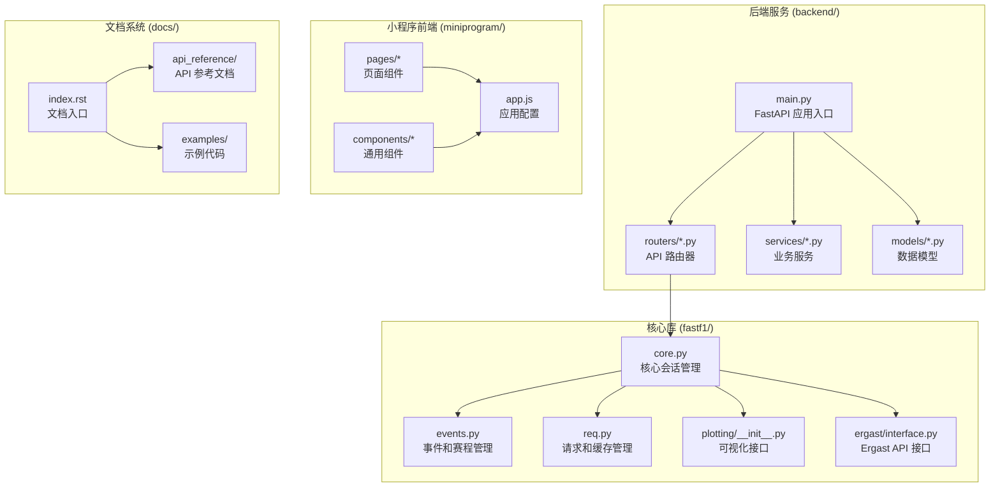
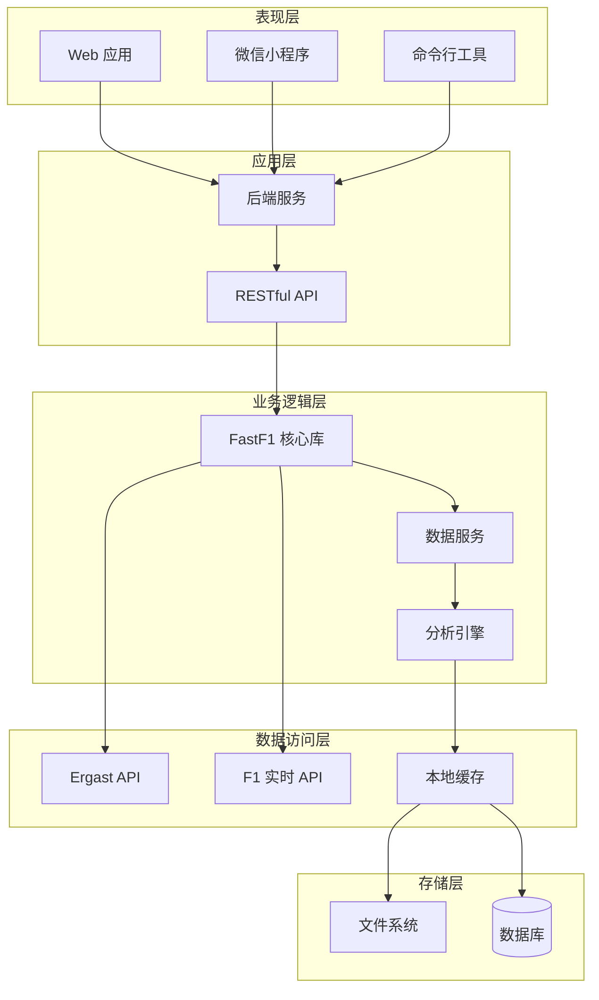
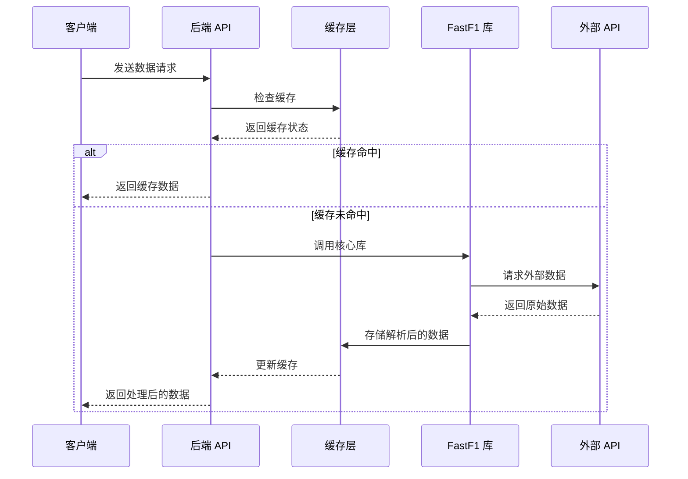
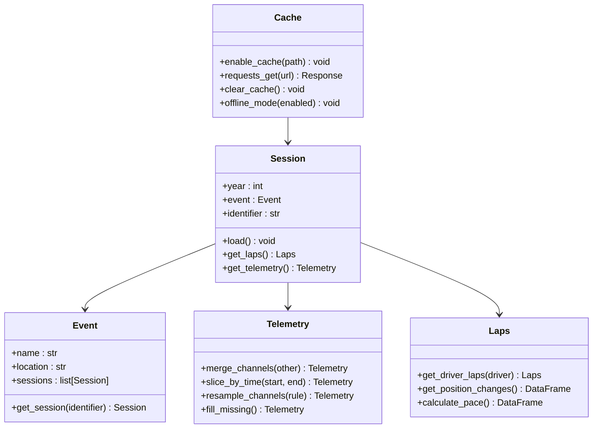
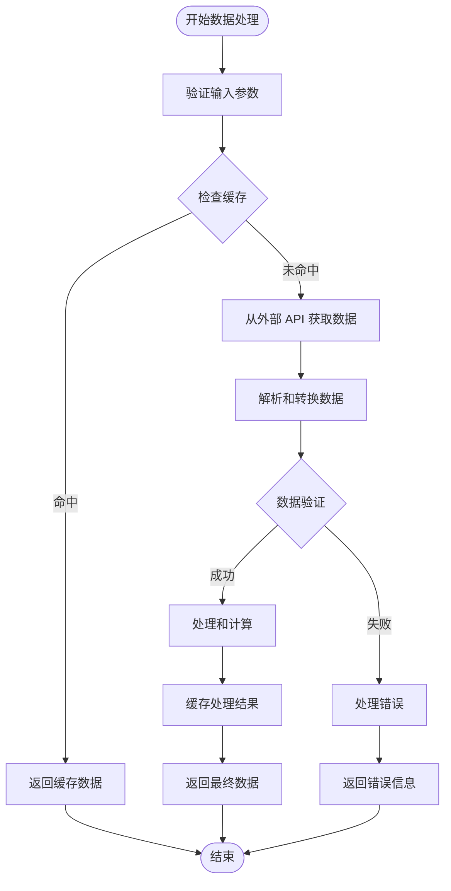
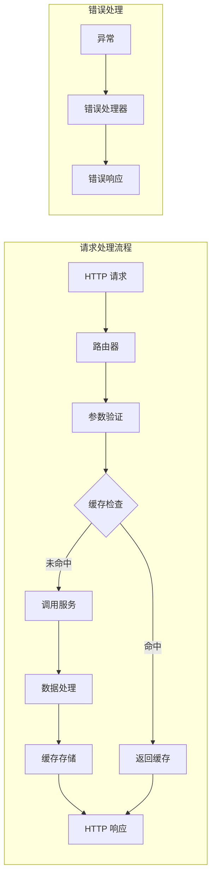
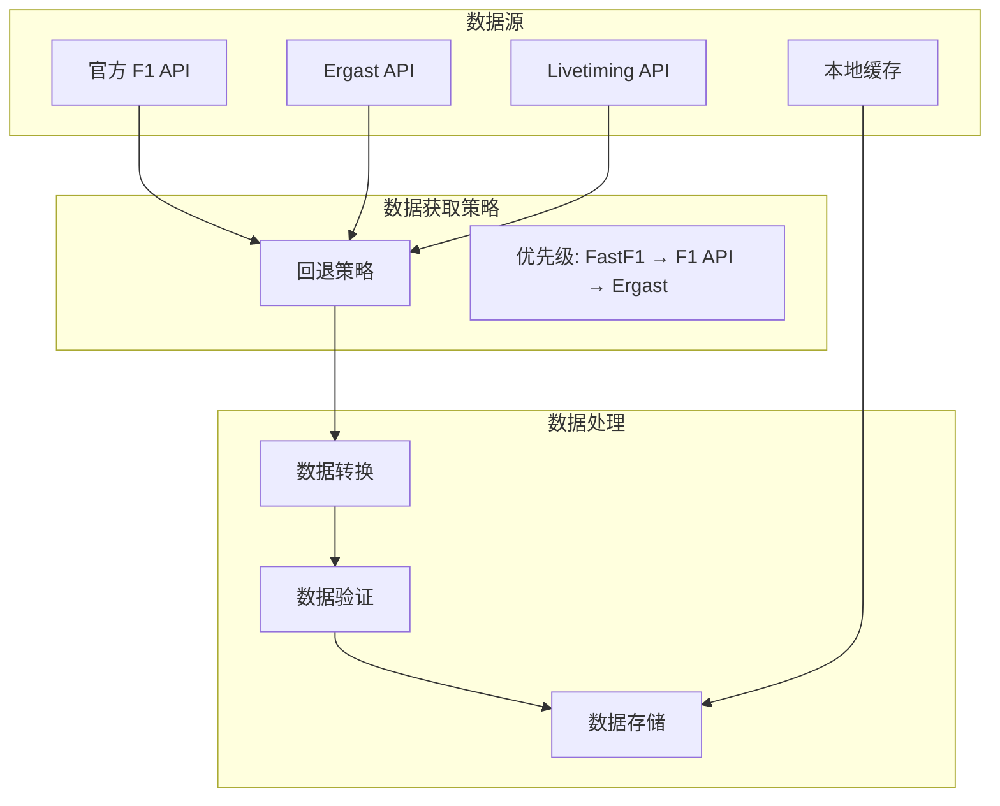
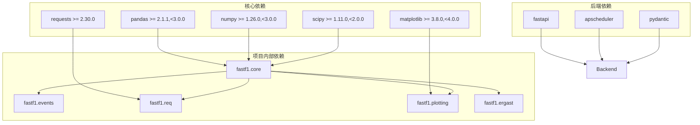
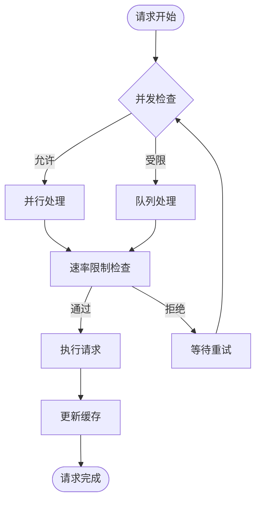

# 项目概述

<cite>
**本文档引用的文件**
- [README.md](file://README.md)
- [pyproject.toml](file://pyproject.toml)
- [fastf1/__init__.py](file://fastf1/__init__.py)
- [fastf1/core.py](file://fastf1/core.py)
- [fastf1/events.py](file://fastf1/events.py)
- [fastf1/req.py](file://fastf1/req.py)
- [fastf1/plotting/__init__.py](file://fastf1/plotting/__init__.py)
- [fastf1/ergast/interface.py](file://fastf1/ergast/interface.py)
- [backend/main.py](file://backend/main.py)
- [backend/routers/events.py](file://backend/routers/events.py)
- [docs/index.rst](file://docs/index.rst)
- [miniprogram/app.js](file://miniprogram/app.js)
</cite>

## 目录
1. [引言](#引言)
2. [项目结构](#项目结构)
3. [核心组件](#核心组件)
4. [架构总览](#架构总览)
5. [详细组件分析](#详细组件分析)
6. [依赖关系分析](#依赖关系分析)
7. [性能考虑](#性能考虑)
8. [故障排除指南](#故障排除指南)
9. [结论](#结论)
10. [附录](#附录)

## 引言

Fast-F1 是一个用于访问和分析一级方程式赛车（F1）结果、赛程、计时数据和遥测数据的 Python 包。该项目旨在为研究人员、数据分析师和爱好者提供强大的工具集，以便轻松获取、处理和可视化 F1 数据。

### 主要特性

根据项目文档，Fast-F1 提供以下核心功能：

- **Ergast 兼容 API 支持**：完整支持 jolpica-f1 的 Ergast 兼容 API，可访问当前和历史 F1 数据
- **Pandas DataFrame 集成**：所有数据均以扩展的 Pandas DataFrame 形式提供，便于数据分析和处理
- **Matplotlib 可视化集成**：内置与 Matplotlib 的集成，简化数据可视化流程
- **缓存机制**：实现全 API 请求的缓存，显著提升脚本运行速度
- **实时数据支持**：通过 Livetiming API 提供实时数据访问能力

### 项目性质

Fast-F1 是一个非官方项目，与一级方程式公司没有任何关联。项目明确声明其非官方性质，并使用相关商标的所有权归 Formula One Licensing B.V. 所有。

## 项目结构

项目采用模块化架构设计，包含核心库、后端服务、微信小程序前端和文档系统四个主要组成部分：

**图表来源**
- [fastf1/core.py:1-800](file://fastf1/core.py#L1-L800)
- [backend/main.py:1-157](file://backend/main.py#L1-L157)

**章节来源**
- [README.md:1-75](file://README.md#L1-L75)
- [pyproject.toml:1-136](file://pyproject.toml#L1-L136)

## 核心组件

### 核心库 (fastf1/)

核心库是整个项目的基础，提供了访问 F1 数据的主要接口和功能：

#### 会话管理系统
- **Session 类**：管理单场比赛的生命周期，包括数据加载、缓存和处理
- **Telemetry 类**：处理遥测数据的时间序列分析和可视化
- **Laps/Lap 类**：管理圈次数据和相关统计信息

#### 事件和赛程管理
- **get_session()**：获取指定年份、大奖赛和会话标识符的会话对象
- **get_event_schedule()**：获取特定赛季的完整赛程
- **Event/EventSchedule 类**：管理赛事信息和赛程安排

#### 缓存和请求管理
- **Cache 类**：实现多级缓存机制，包括 HTTP 请求缓存和解析数据缓存
- **Rate Limiting**：实施 API 速率限制，防止超出服务端限制
- **Offline Mode**：支持离线模式，仅使用缓存数据

#### 可视化集成
- **Matplotlib 集成**：提供与 Matplotlib 的无缝集成
- **颜色映射**：内置 F1 车队和车手的颜色映射系统
- **图表样式**：提供专业的 F1 数据可视化样式

**章节来源**
- [fastf1/core.py:64-800](file://fastf1/core.py#L64-L800)
- [fastf1/events.py:50-402](file://fastf1/events.py#L50-L402)
- [fastf1/req.py:132-695](file://fastf1/req.py#L132-L695)
- [fastf1/plotting/__init__.py:1-48](file://fastf1/plotting/__init__.py#L1-L48)

### 后端服务 (backend/)

后端服务基于 FastAPI 构建，提供 RESTful API 接口来访问 F1 数据：

#### API 路由器
- **events 路由器**：提供赛程查询和赛事信息
- **telemetry 路由器**：处理遥测数据查询和分析
- **standings 路由器**：提供积分榜数据
- **analysis 路由器**：AI 分析和预测功能

#### 业务服务
- **fastf1_service**：封装 FastF1 库的调用
- **rule_engine**：实现 F1 数据分析规则
- **llm_client**：集成大型语言模型进行智能分析

#### 缓存策略
- **内存缓存**：短期数据缓存，提高响应速度
- **文件缓存**：持久化缓存，支持跨进程共享
- **预热机制**：启动时预加载常用数据

**章节来源**
- [backend/main.py:1-157](file://backend/main.py#L1-L157)
- [backend/routers/events.py:1-506](file://backend/routers/events.py#L1-L506)

### 微信小程序前端 (miniprogram/)

小程序前端提供移动端访问 F1 数据的界面：

#### 页面结构
- **首页**：展示当前赛季的赛程列表
- **赛事详情**：显示具体赛事的信息和统计数据
- **遥测对比**：提供车手遥测数据的对比分析
- **积分榜**：实时显示车手和车队积分情况

#### 组件系统
- **echarts 封装**：基于 ECharts 的图表组件
- **AI 报告**：Markdown 格式的智能分析报告渲染
- **导航组件**：统一的页面导航和状态管理

**章节来源**
- [miniprogram/app.js:1-23](file://miniprogram/app.js#L1-L23)

### 文档系统 (docs/)

文档系统采用 Sphinx 构建，提供完整的项目文档：

#### 文档结构
- **入门指南**：快速开始和安装说明
- **API 参考**：详细的类和函数文档
- **数据参考**：可用数据类型的完整说明
- **示例画廊**：丰富的使用示例

#### 特色功能
- **交互式示例**：可直接运行的代码示例
- **数据类型说明**：详细的字段定义和使用说明
- **版本变更记录**：完整的版本历史和更新日志

**章节来源**
- [docs/index.rst:1-185](file://docs/index.rst#L1-L185)

## 架构总览

Fast-F1 采用分层架构设计，确保各组件之间的松耦合和高内聚：

**图表来源**
- [backend/main.py:1-157](file://backend/main.py#L1-L157)
- [fastf1/req.py:132-695](file://fastf1/req.py#L132-L695)

### 数据流架构

**图表来源**
- [fastf1/req.py:260-332](file://fastf1/req.py#L260-L332)
- [backend/main.py:117-136](file://backend/main.py#L117-L136)

## 详细组件分析

### 核心库架构

#### 类层次结构

**图表来源**
- [fastf1/core.py:64-800](file://fastf1/core.py#L64-L800)
- [fastf1/events.py:640-800](file://fastf1/events.py#L640-L800)
- [fastf1/req.py:132-200](file://fastf1/req.py#L132-L200)

#### 数据处理流程

**图表来源**
- [fastf1/req.py:396-470](file://fastf1/req.py#L396-L470)
- [fastf1/core.py:64-200](file://fastf1/core.py#L64-L200)

### 后端服务架构

#### API 设计模式

**图表来源**
- [backend/main.py:1-157](file://backend/main.py#L1-L157)
- [backend/routers/events.py:21-53](file://backend/routers/events.py#L21-L53)

#### 缓存策略

后端实现了多层次的缓存策略来优化性能：

1. **内存缓存**：短期数据缓存，TTL 6小时
2. **文件缓存**：持久化缓存，支持跨进程共享
3. **预热机制**：启动时预加载常用数据

**章节来源**
- [backend/routers/events.py:9-20](file://backend/routers/events.py#L9-L20)
- [backend/main.py:55-126](file://backend/main.py#L55-L126)

### 数据源集成

#### 多源数据获取

**图表来源**
- [fastf1/events.py:318-342](file://fastf1/events.py#L318-L342)
- [fastf1/ergast/interface.py:401-430](file://fastf1/ergast/interface.py#L401-L430)

**章节来源**
- [fastf1/events.py:318-342](file://fastf1/events.py#L318-L342)
- [fastf1/ergast/interface.py:401-430](file://fastf1/ergast/interface.py#L401-L430)

## 依赖关系分析

### 核心依赖关系

项目采用模块化设计，各组件之间保持清晰的依赖关系：

**图表来源**
- [pyproject.toml:29-44](file://pyproject.toml#L29-L44)

### 第三方集成

#### 数据源集成
- **Ergast API**：提供历史 F1 数据访问
- **F1 实时 API**：提供实时比赛数据
- **Livetiming API**：提供实时计时数据

#### 工具链集成
- **Matplotlib**：数据可视化
- **Requests-Cache**：HTTP 请求缓存
- **Pydantic**：数据验证和序列化

**章节来源**
- [pyproject.toml:29-44](file://pyproject.toml#L29-L44)

## 性能考虑

### 缓存策略优化

Fast-F1 实现了多级缓存机制来优化性能：

#### 阶段式缓存
1. **阶段 1：HTTP 请求缓存**
   - 使用 SQLite 数据库存储原始 HTTP 响应
   - 缓存控制和过期机制
   - 支持条件请求和缓存刷新

2. **阶段 2：解析数据缓存**
   - 存储解析后的结构化数据
   - 使用 Pickle 序列化复杂对象
   - 版本控制确保数据兼容性

#### 缓存配置
- **默认缓存目录**：操作系统特定的缓存路径
- **环境变量支持**：可通过 `FASTF1_CACHE` 自定义缓存位置
- **缓存清理**：提供完整的缓存清理和管理工具

### 并发和异步处理

**图表来源**
- [fastf1/req.py:83-113](file://fastf1/req.py#L83-L113)

### 内存管理

- **延迟加载**：数据按需加载，避免不必要的内存占用
- **数据类型优化**：使用合适的数据类型减少内存使用
- **垃圾回收**：及时释放不再使用的对象

## 故障排除指南

### 常见问题和解决方案

#### 缓存相关问题
- **缓存损坏**：使用 `Cache.clear_cache()` 清理缓存
- **缓存空间不足**：定期清理旧数据或调整缓存策略
- **缓存失效**：使用 `Cache.offline_mode(True)` 进行离线调试

#### API 限制问题
- **速率限制**：检查网络连接和 API 限制设置
- **数据获取失败**：验证网络连接和外部 API 可用性
- **超时问题**：调整请求超时时间和重试策略

#### 数据质量问题
- **数据格式错误**：检查数据解析和转换逻辑
- **数据缺失**：验证数据源和回退机制
- **数据不一致**：检查缓存版本和数据同步

**章节来源**
- [fastf1/req.py:350-394](file://fastf1/req.py#L350-L394)
- [fastf1/exceptions.py](file://fastf1/exceptions.py)

### 调试和监控

- **日志记录**：详细的日志输出帮助诊断问题
- **性能监控**：内置性能指标收集和分析
- **错误报告**：友好的错误消息和解决方案建议

## 结论

Fast-F1 是一个设计精良、功能全面的一级方程式数据处理框架。项目通过模块化架构实现了核心库、后端服务、前端应用和文档系统的有机结合，为用户提供了一站式的 F1 数据分析解决方案。

### 主要优势

1. **技术架构先进**：采用现代 Python 技术栈和最佳实践
2. **性能优化完善**：多级缓存和并发处理机制
3. **用户体验优秀**：丰富的 API 接口和可视化功能
4. **扩展性强**：模块化设计便于功能扩展和定制

### 适用场景

- **学术研究**：F1 数据分析和统计研究
- **商业应用**：赛车分析和策略制定
- **个人爱好**：F1 数据可视化和探索
- **教育用途**：数据科学和机器学习教学

### 发展方向

随着一级方程式运动的发展和技术的进步，Fast-F1 项目将继续演进，为用户提供更强大、更便捷的数据分析工具。

## 附录

### 安装和配置

项目支持多种安装方式，包括 pip、conda 和源码安装。详细的安装说明和配置选项可在官方文档中找到。

### 社区和支持

项目拥有活跃的社区支持，用户可以通过 GitHub Discussions 获取帮助和交流经验。

### 许可证和法律声明

Fast-F1 项目采用 MIT 许可证，但需注意项目与一级方程式公司的非官方关系。